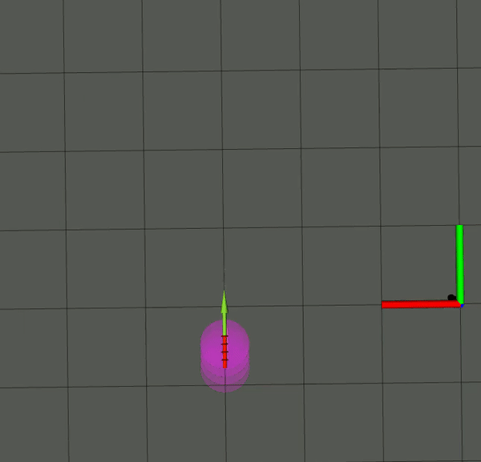

# Hands-on Localization

## Description
This repo contains the implementation of pose graph SLAM using a 2D lidar and imu. Everything was implemented from scratch including motion model, measurement model, prediction and update. This followed a filtering approach with Extended Kalman Filter being the filter of choice.

## Results

Scan alignment using ICP

SLAM

For an extended video click

[SLAM](media/pose-graph-slam_cropped_edited.mp4)

<video width="640" height="480" controls>
  <source src="media/pose-graph-slam_cropped_edited.mp4" type="video/mp4">
</video>

## Dependencies:

pip install shapely

pip install scipy

last update:

## How to Run on Hardware
1. roslaunch pose-graph-slam test_kobuki_basic.launch
2. rosrun pose-graph-slam working.py
3. roslaunch pose-graph-slam kobuki_keyboard_control1.launch

## How to run in simulation

**launch sim**
1. roslaunch turtlebot_simulation turtlebot_hoi_circuit1.launch
or 
2. roslaunch turtlebot_simulation turtlebot_hoi_circuit2.launch

**Launch manual control nodes**

2. roslaunch pose-graph-slam kobuki_keyboard_control.launch

**Launch SLAM**

4. rosrun pose-graph-slam integration.py

